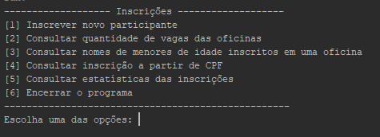
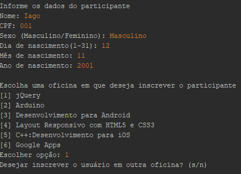
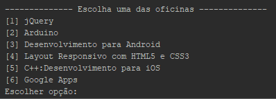
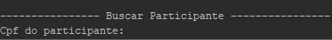

## Descrição do projeto

Aplicação para gerenciamento de inscrições em um evento promovido por uma instituição. Onde é feito inscrições de participantes em oficinas deste evento e é possível o acesso a informações sobre essas inscrições.

## Descrição das funções

No aplicativo é possível fazer inscrições de participantes com as informações de nome, CPF, sexo e data de nascimento, sendo permitido a inscrição de um único participante por CPF, podendo ser cadastrado em uma a três oficinas, são 6 oficinas disponíveis e cada uma com o limite de 30 vagas.

Pelo CPF é possível fazer a busca no sistema por informações do participante, pode ser verificado também a quantidade de vagas em cada oficina, além de ter os nomes de todos os participantes menores de idade cadastrados em uma oficina especifica.

Pode ser feita a consulta sobre as estatísticas das inscrições, onde é dada percentuais a partir do sexo dos participantes, dos números de inscritos por oficina e percentual de faixa etária dos inscritos em cada uma dessas oficinas.

## Orientações de uso

 
Essa é a tela inicial onde deve ser escolhido uma opção de 1 a 6, cada opção tem sua descrição da sua função logo após o número indicada a ela.

  
Ao escolher a opção 1 deverá ser inserido os dados pedidos sobre o participante, nome, apenas os números do CPF, sexo masculino ou feminino e o dia, o mês e o ano de nascimento. Após isso é necessário escolher que oficina o participante será inscrito. Após escolher a primeira oficina será perguntando se deseja inscrever em outra oficina se sim escreve “s” se não escreva “n” e enviei a resposta com a tecla enter.

 
Caso escolha a opção 3 será necessário escolher uma opção de 1 a 6 indicando a oficina escolhida para que a informação seja buscada.

 
Na opção 4 deverá ser informado apenas os números do CPF do participante, este CPF deverá ser igual ao utilizado na inscrição, levando em conta todos os seus números.

Todas as outras opções executaram a função que esta descrita e não precisarão de interação extra por parte do usuário.

